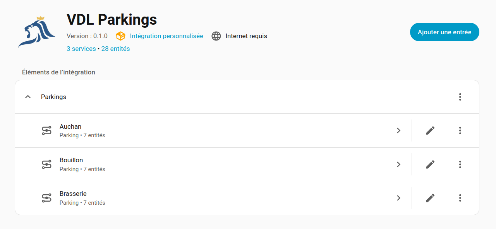
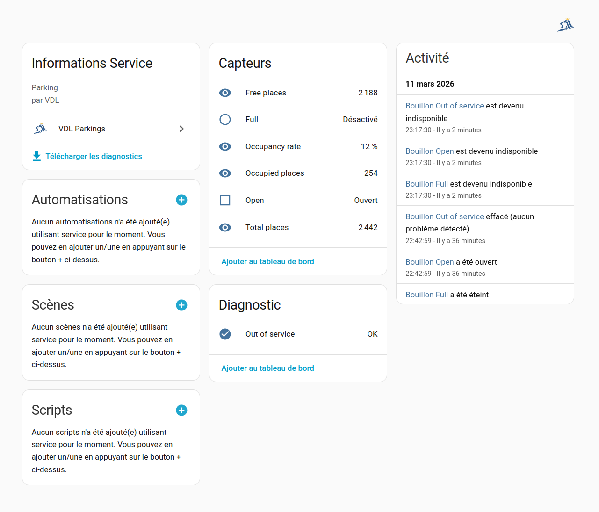
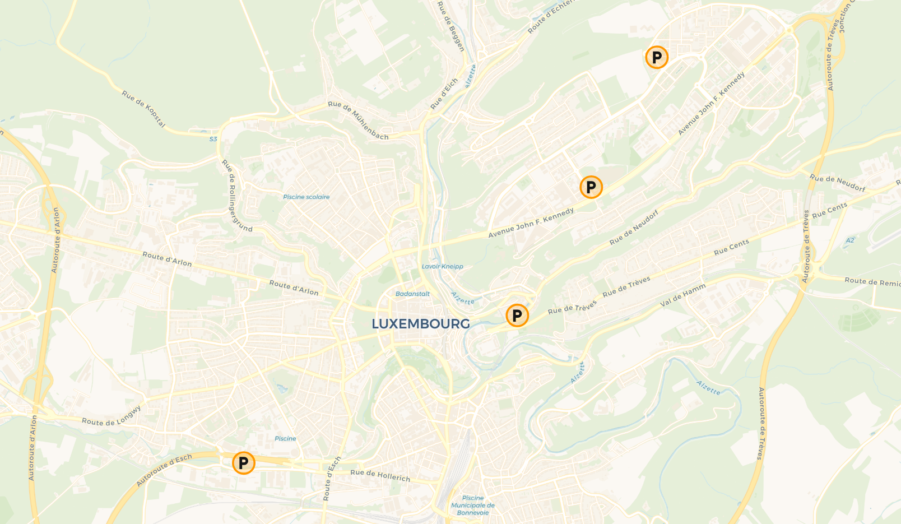

# VDL Parkings – Home Assistant Custom Integration

Home Assistant custom integration to monitor the availability and status of public parkings in Luxembourg city (VDL - Ville De Luxembourg) using the public data from [vdl.lu](https://vdl.lu) website.

> [!WARNING]
> 🚧 **Beta** – this integration is under active development 🚧
> - Features and entities may change between releases.
> - Use at your own risk and keep regular backups of your Home Assistant configuration.
> - Please [report issues](https://github.com/pschmucker/vdl-parkings/issues) with logs and details.


## Features

- Cloud polling of the public VDL parking data (no account or API key required, only Internet access).
- One set of entities per parking:
    - `sensor` entities:
        - Total capacity
        - Available spaces
        - Occupied spaces
        - Occupancy rate as a percentage
    - `binary_sensor` entities:
        - Open
        - Full
        - Out of service
    - A `zone` entity to expose its geolocation (usable for proximity, automations, maps).
- Configuration via the Home Assistant UI (`config_flow`), no YAML needed.


## Requirements

- Home Assistant Core **2026.3.0** or newer.  
- Working Internet connection to reach the VDL public parking API (cloud polling, `iot_class: cloud_polling`).  
- No external Python library dependencies (empty `requirements` in `manifest.json`).


## Installation

### HACS (recommended)

1. In Home Assistant, go to **HACS → Integrations → Custom repositories**.
2. Add this repository URL `https://github.com/pschmucker/vdl-parkings` as type **Integration**.
3. Search for **VDL Parkings** in HACS and install it.
4. Restart Home Assistant.
5. Add the integration from **Settings → Devices & Services → Add integration → VDL Parkings**.

### Manual installation

1. Download or clone this repository.
2. Copy the `custom_components/vdl_parkings` folder into your Home Assistant `config/custom_components` directory.
3. Ensure the final path is:
   `config/custom_components/vdl_parkings` (folder name must match the domain).
4. Restart Home Assistant.
5. Add the integration from **Settings → Devices & Services → Add integration → VDL Parkings**.


## Configuration

The integration is configured entirely from the UI via a **config flow**.

1. Go to **Settings → Devices & Services → Add integration**.
2. Search for **VDL Parkings**.
3. Follow the onboarding steps to:
   - Select which parkings you want to monitor
   - Optionally assign areas to selected parkings
   - Validate

At the moment there is no advanced options exposed in the Options flow.


## Provided entities

For each selected parking, the integration creates multiple entities. The exact entity IDs may vary slightly depending on your Home Assistant server language.

### Sensor entities

| Entity class              | Example entity ID                            | Description                                          |
|---------------------------|----------------------------------------------|------------------------------------------------------|
| `ParkingTotalCapacity`    | `sensor.<parking_name>_total_capacity`        | Total number of parking spaces.              |
| `ParkingAvailableSpaces`  | `sensor.<parking_name>_available_spaces`      | Current number of free spaces.               |
| `ParkingOccupiedSpaces`   | `sensor.<parking_name>_occupied_spaces`       | Current number of occupied spaces.           |
| `ParkingOccupancyRate`    | `sensor.<parking_name>_occupancy_rate`        | Percentage of occupied spaces. |


### Binary sensor entities

| Entity class            | Example entity ID                           | Description                                                                 |
|-------------------------|---------------------------------------------|-----------------------------------------------------------------------------|
| `ParkingOpen`           | `binary_sensor.<parking_name>_open`          | On when the parking is open, off when closed.                      |
| `ParkingFull`           | `binary_sensor.<parking_name>_full`          | On when the parking is considered full.                            |
| `ParkingOutOfService`   | `binary_sensor.<parking_name>_out_of_service`| On when the parking is out of service, closed for maintenance, etc. |

### Zone entities

- A `zone` is created for each parking to expose its geolocation in the map and for proximity-based automations.
- The zone name matches the parking name.


## Example usage

### Simple Lovelace card

Example: show availability for a single parking using an Entities card:

```yaml
type: entities
title: Parking Royal Hamilius
entities:
  - entity: sensor.royal_hamilius_available_spaces
    name: Available spaces
  - entity: sensor.royal_hamilius_total_capacity
    name: Total capacity
  - entity: sensor.royal_hamilius_occupied_spaces
    name: Occupied spaces
  - entity: binary_sensor.royal_hamilius_full
    name: Full
  - entity: binary_sensor.royal_hamilius_open
    name: Open
```

### Conditional notification when a parking has space

```yaml
alias: Notify when parking has space
trigger:
  - platform: numeric_state
    entity_id: sensor.royal_hamilius_available_spaces
    above: 10
condition:
  - condition: state
    entity_id: binary_sensor.royal_hamilius_open
    state: "on"
action:
  - service: notify.mobile_app_my_phone
    data:
      message: "Royal Hamilius has more than 10 free parking spaces."
mode: single
```

### Map view with zones

Once zones are created for each parking, you can add the standard **Map** card in Lovelace and enable the parking zones to visualize all monitored parkings on a map.


## Screenshots

### Integration page



### Parking entities overview



### Map view with parking zones




## FAQ

**Does this integration require an account or API key?**
No. It uses the public JSON API provided by vdl.lu for parking information, so no credentials are required.

**How often is data updated?**
The integration uses cloud polling at a fixed interval of 60 seconds. The effective refresh rate is limited by both the integration and the VDL API update frequency.

**Can I select which parkings to track?**
Yes, the configuration flow allows choosing which parkings to monitor.

**Can I change the polling interval or configure advanced options?**
Not yet. The first versions only provide a minimal UI configuration without extra options. Future releases may add options such as polling interval.

**Does this integration support YAML configuration?**
No. It is UI-only and uses the recommended `config_flow` for setup.


## Troubleshooting

**Integration does not appear in the “Add integration” list**  
- Check that the folder is named `vdl_parkings` under `custom_components` and that Home Assistant has been restarted.  
- Clear your browser cache or try another browser.

**No entities are created**  
- Verify that the config flow has completed successfully and that at least one parking was selected.  
- Check **Settings → System → Logs** for errors related to `vdl_parkings`.  
- Ensure that your Home Assistant host has working Internet access to reach the VDL API.

**Data seems outdated or not updating**  
- Check for rate limiting or connectivity issues in the logs.  
- Confirm that the source VDL website/API shows up-to-date information.

**Too many entities / clutter**  
- During setup, only select the parkings that you actually need. You can also disable unnecessary entities from the entity settings in Home Assistant.


## Development and contributions

Contributions, bug reports and feature requests are welcome via the [GitHub issue tracker](https://github.com/pschmucker/vdl-parkings/issues). Please include Home Assistant version, integration version, logs and clear reproduction steps when reporting bugs.
